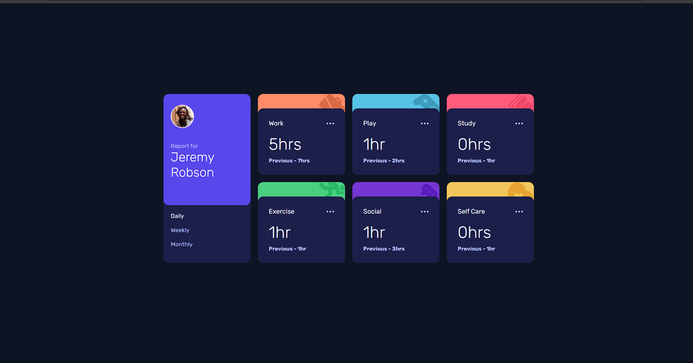

# Frontend Mentor - Time tracking dashboard solution

This is a solution to the [Time tracking dashboard challenge on Frontend Mentor](https://www.frontendmentor.io/challenges/time-tracking-dashboard-UIQ7167Jw).

### Screenshot

### Links

- Solution URL: [here](https://www.frontendmentor.io/solutions/newsletter-sign-up-form-with-success-message-solution-XLeRWZUZ7l)
- Live Site URL: [here](https://sunilbaghel002.github.io/newsletter-sign-up-with-success-message-main/)

## My process

### Built with

- Semantic HTML5 markup
- CSS custom properties
- CSS Variables
- CSS Grid
- CSS Media Queries
- CSS Animation
- Basic JS
- DOM multiplation

# 🚀🚀🚀